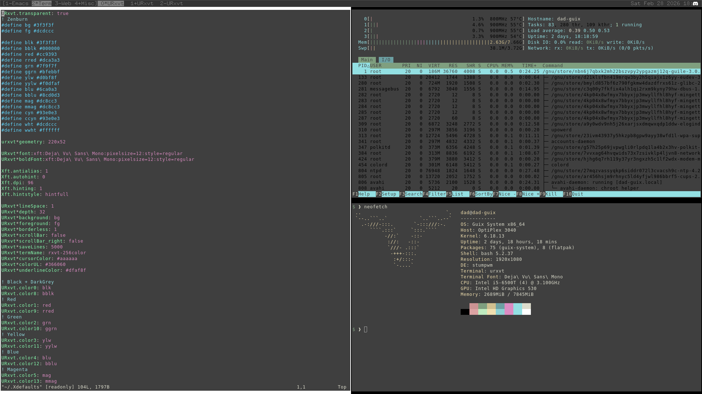
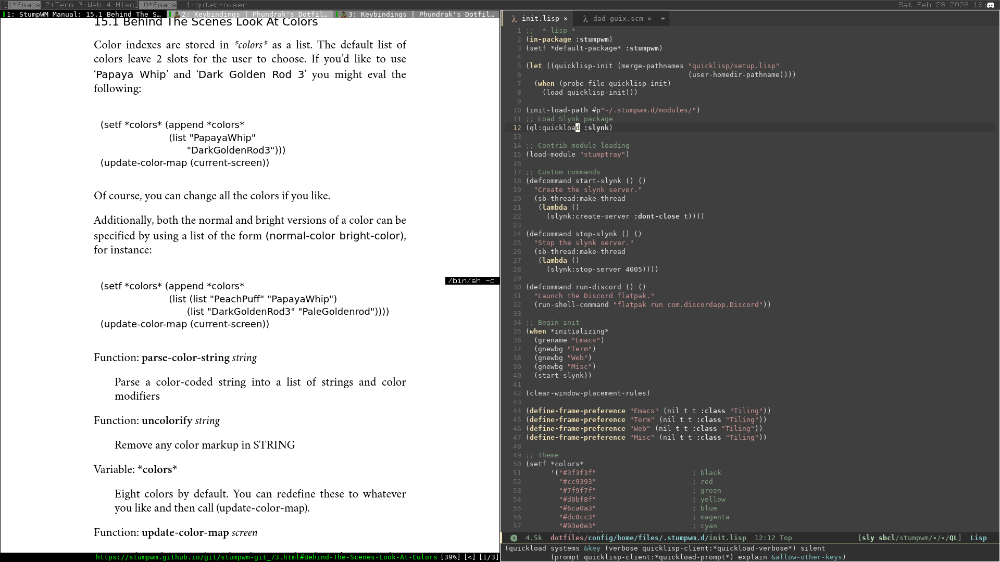

# Guix Dotfiles
> Brian Tomlinson <darthlukan at gmail dot com>

Screenshots:




## Description

My personal [Guix System](https://guix.gnu.org/) running on a Dell Optiplex 3040m. Features the use of [StumpWM](https://github.com/stumpwm/stumpwm).

A few things to watch out for, the following were pulled manually
and not packaged ["The Guix Way"](https://guix.gnu.org/manual/devel/en/html_node/Defining-Packages.html):
1. [Quicklisp](https://www.quicklisp.org/beta/)
2. [stumpwm-contrib](https://github.com/stumpwm/stumpwm-contrib)
3. This machine includes the use of non-free (as in freedom) software and hardware[^1].

## Layout

I cribbed the layout from [System Crafters excellent article](https://systemcrafters.net/craft-your-system-with-guix/how-to-organize-your-config/) and video on setting up a
`dotfiles` repo for the Guix System.

``` shell
config/
  home/
    files/
      .stumpwm.d/
        init.lisp
      .bash_profile
      .bashrc
      gitconfig
      quicklisp.lisp
      sbclrc
      Xdefaults
    services/
    $HOSTNAME.scm
  packages/
  services/
  systems/
    $HOSTNAME-channels.scm
    $HOSTNAME-system.scm
  files/
```

I'm not making full use of the directory layout as I don't have any custom packages or
services defined. However, as I'm migrating to this style of setup, I think I can be forgiven
for keeping it simple.

## Configuration

There's no magic here. `config/home/dad-guix.scm` contains the home configuration and is
applied by way of `guix home reconfigure ~/guix-dotfiles/config/home/dad-guix.scm`. Likewise
for the top-level system config, `guix home reconfigure ~/guix-dotfiles/config/system/dad-guix-system.scm`. I manually copy both `dad-guix-system.scm`
and `dad-guix-channels.scm` to `/etc/config.scm` and `/etc/guix/channels.scm` respectively.
I should probably change this somehow, but as I'm still reading through the `guix` sources
on how it handles system and channel configurations (because the docs leave some details out)
I decided to keep it simple. "Boo" for manual toil.

## Footnotes
[^1] In an ideal world we wouldn't need to use non-free blobs to make hardware work, or
need to use proprietary software in order to communicate.

## License
MIT License. See LICENSE file.
